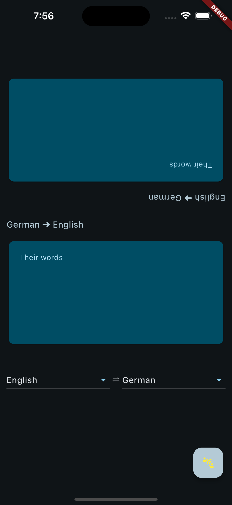

# Translation Circuit

A frontend for a two-party verbal interpretation system using Google Cloud Platform (GCP).

## Features

- Real-time bidirectional speech translation to facilitate a conversation between two people
- Supports multiple languages
- Cross-platform: Android, iOS, and macOS

## Screenshots

### Android

### iOS

### macOS

## Installation

### Prerequisites

- Flutter SDK: [Install Flutter](https://flutter.dev/docs/get-started/install)
- My [fork](https://github.com/critt/transcription_service) of [this repo](saharmor/realtime-transcription-playground), which serves as the backend for this application.
- Google Cloud Platform account with [Cloud Speech-to-Text API](https://cloud.google.com/speech-to-text/?hl=en), [Cloud Translation API](https://cloud.google.com/translate?hl=en), a service account, and a JSON credentials file for the service account.
    - These are actually prerequisites for the backend, not the fork. Just listing them here to let you know what you are in for from the start. The backend repo has more information on its own installation and setup. Just make sure to enable the translation API in GCP in addition to the Speech-to-Text API. 

